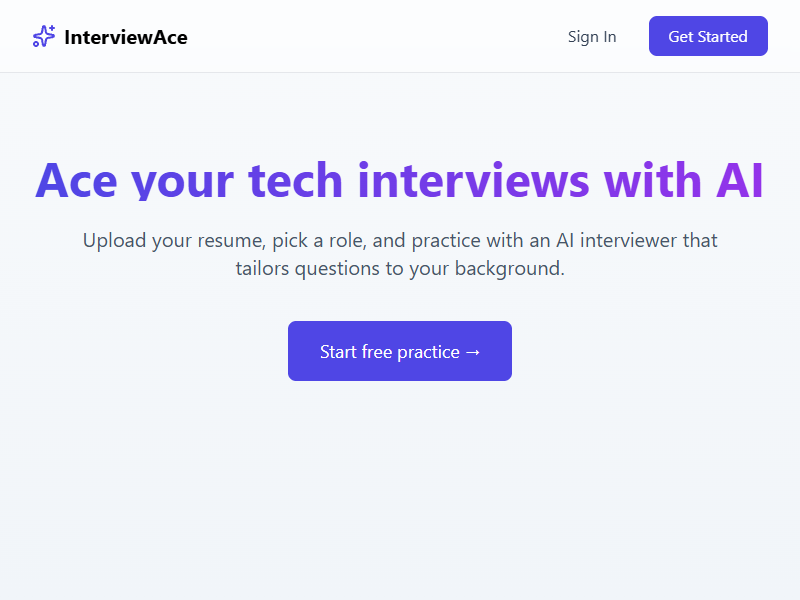
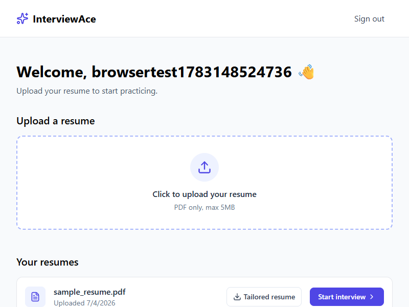
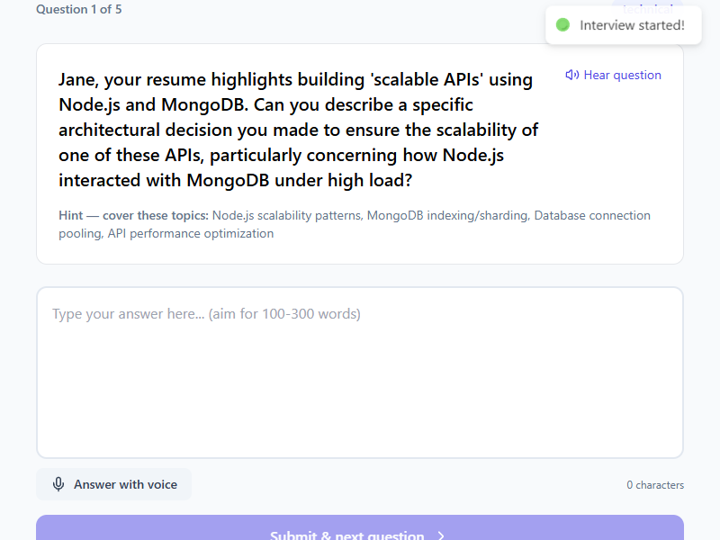
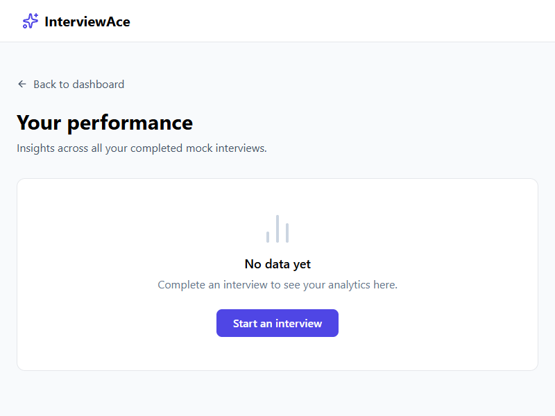
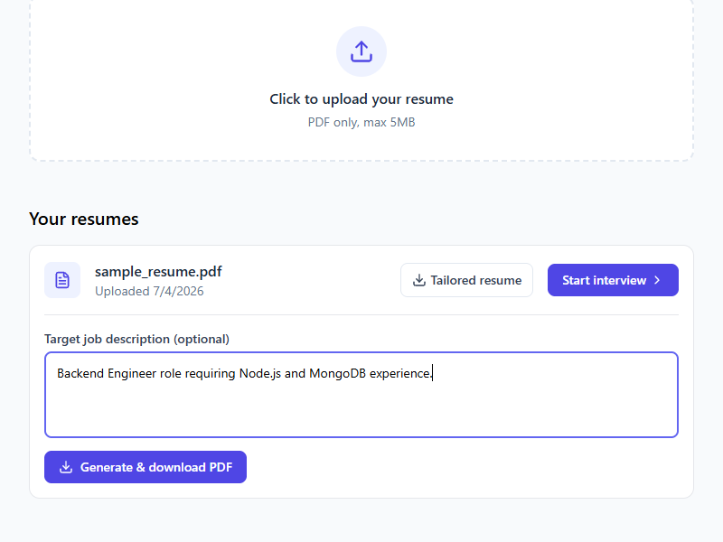
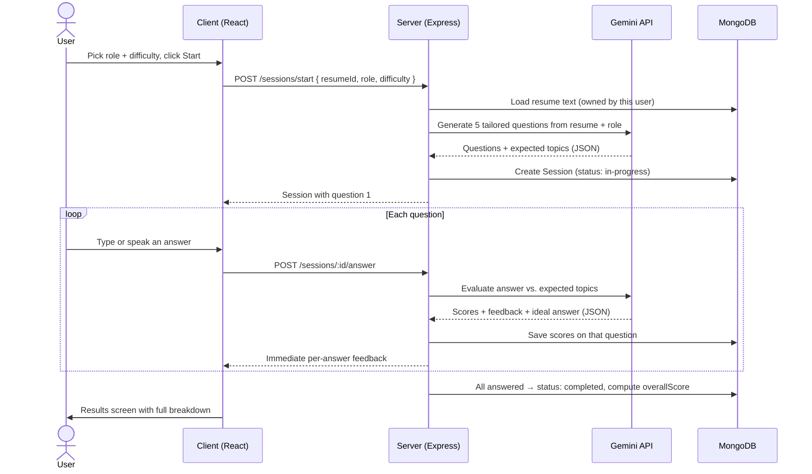
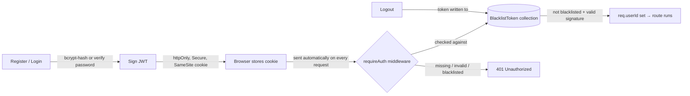
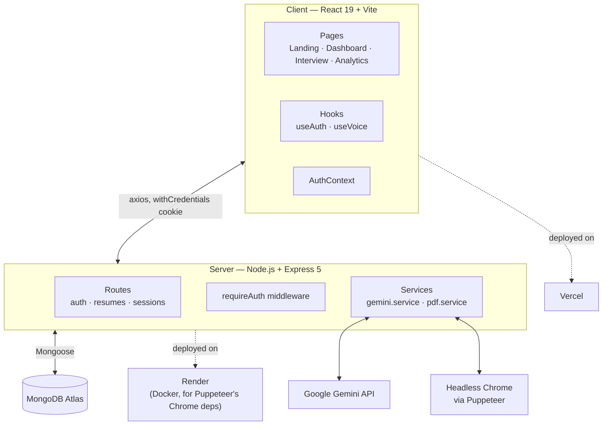

<div align="center">

# 🎯 InterviewAce

### AI-powered mock interview practice — tailored questions, live scoring, and a resume that keeps up with you

[](https://react.dev)
[](https://expressjs.com)
[](https://www.mongodb.com/atlas)
[](https://ai.google.dev)
[](https://vercel.com)
[](https://render.com)
[](#license)

</div>

---

## What is this?

InterviewAce is a full-stack mock interview platform. Upload a resume, pick a target role, and an AI interviewer asks you role-specific questions one at a time — typed or spoken out loud. Every answer is scored the moment you submit it, not just at the end, and a dashboard tracks how your performance trends across sessions. A second AI feature rewrites your resume for a specific job posting and hands you back a ready-to-send PDF.

It's a from-scratch build: custom JWT authentication (no third-party auth provider), a self-written retry layer around the Gemini API, and a headless-Chrome pipeline for turning AI-generated HTML into a real PDF.

<table>
<tr>
<td width="50%">

**Practice, not just prep**
Answer real questions live, get scored on content / structure / technical depth, and see a model answer immediately after.

</td>
<td width="50%">

**Speak or type**
Full voice mode — hear the question read aloud, answer out loud, or just type. Your call, per question.

</td>
</tr>
<tr>
<td>

**Track improvement over time**
A trend line, a skill-dimension radar, and a by-role breakdown — not just a single score.

</td>
<td>

**A resume that adapts**
Paste a job description, get back an ATS-friendly, tailored resume as a downloadable PDF — generated fresh each time.

</td>
</tr>
</table>

---

## See it in action

<table>
<tr>
<td align="center" width="50%">

<sub>Landing page</sub>
</td>
<td align="center" width="50%">

<sub>Dashboard — resumes, tailored-resume export, start an interview</sub>
</td>
</tr>
<tr>
<td align="center">

<sub>Live interview — question, hints, voice input</sub>
</td>
<td align="center">

<sub>Analytics — score trend, skill radar, by-role breakdown</sub>
</td>
</tr>
</table>

<p align="center">

<br><sub>Generate a job-tailored resume PDF straight from the dashboard</sub>
</p>

---

## How a mock interview actually works



## How the auth actually works

No third-party auth provider — bcrypt, JWTs, and an explicit revocation list, wired by hand.



> **Why a blacklist?** JWTs are stateless — once issued, they're valid until they expire, with no built-in way to revoke one early. Logging out writes that token into a `BlacklistToken` collection, and every request checks it there before trusting an otherwise-valid signature.

## How the AI resume export works

```mermaid
flowchart TD
    A[Uploaded resume PDF] -->|pdfreader| B[Extracted plain text]
    J[Optional job description] --> D
    B --> D[Prompt built from resume + job description]
    D -->|Zod schema enforces response shape| E[Gemini API]
    E -->|Structured JSON: { html }| F[Generated resume HTML]
    F -->|Puppeteer headless Chrome| G[Rendered PDF buffer]
    G --> H[Streamed to browser as a download]
```

---

## Architecture



---

## Tech stack

| Layer | Technology | Why |
|---|---|---|
| **Frontend** | React 19, Vite, react-router-dom v7 | Fast dev loop, modern routing |
| **Styling** | Tailwind CSS | Utility-first, no custom CSS build |
| **Charts** | Recharts | Line / radar / bar charts for analytics |
| **Voice** | Web Speech API | Native browser STT/TTS, no extra service |
| **Backend** | Node.js, Express 5 | Minimal, well-understood REST layer |
| **Database** | MongoDB + Mongoose | Nested session/question documents fit the document model |
| **Auth** | bcrypt, jsonwebtoken, cookie-parser | Full control over session security, no vendor lock-in |
| **AI** | Google Gemini API (`@google/generative-ai`) | Structured JSON output via schema-constrained prompts |
| **Schema validation** | Zod + zod-to-json-schema | Guarantees the AI's output shape before it hits the client |
| **PDF generation** | Puppeteer | Renders AI-authored HTML into a real, downloadable PDF |
| **Hosting** | Vercel (client), Render (server, Docker) | Static hosting + a container that can run headless Chrome |

---

## Project structure

```
ai-interview-prep/
├── client/                      React + Vite frontend
│   └── src/
│       ├── context/             AuthContext — shared user/loading state
│       ├── hooks/                useAuth (session logic) · useVoice (Web Speech API)
│       ├── components/          Protected (route guard) · ResumeUpload
│       ├── pages/                Landing · SignIn/Up · Dashboard · Interview · Analytics
│       └── lib/api.js            Shared axios instance (withCredentials)
│
└── server/                      Express backend
    └── src/
        ├── models/               User · BlacklistToken · Resume · Session
        ├── middleware/           requireAuth — verifies JWT cookie + blacklist
        ├── controllers/          auth.controller.js
        ├── routes/               auth · resume (+ resume-pdf) · session (+ stats)
        ├── services/             gemini.service.js (retry/backoff) · pdf.service.js (Puppeteer)
        ├── prompts/               questionGen · answerEval · resumePdf
        └── Dockerfile             ghcr.io/puppeteer/puppeteer base image
```

---

## Getting started

### Prerequisites
- Node.js 20+
- A MongoDB connection string (local or [Atlas](https://www.mongodb.com/atlas))
- A [Gemini API key](https://ai.google.dev)

### 1. Clone and install

```bash
git clone https://github.com/dhanubansal777/ai-interview-prep.git
cd ai-interview-prep

cd server && npm install
cd ../client && npm install
```

### 2. Configure environment variables

**`server/.env`**

| Variable | Description |
|---|---|
| `PORT` | Port the API listens on (default `5000`) |
| `NODE_ENV` | `production` enables `Secure`/`SameSite=None` cookies for cross-site deploys |
| `MONGODB_URI` | MongoDB connection string |
| `CLIENT_URL` | Deployed frontend origin, for CORS |
| `JWT_SECRET` | Long random string used to sign auth tokens |
| `GEMINI_API_KEY` | Your Gemini API key |

**`client/.env`**

| Variable | Description |
|---|---|
| `VITE_API_URL` | Backend base URL, **including `/api`** |

### 3. Run it

```bash
# Terminal 1
cd server && npm run dev

# Terminal 2
cd client && npm run dev
```

Visit `http://localhost:5173`.

---

## API reference

| Method | Endpoint | Auth | Description |
|---|---|:---:|---|
| `POST` | `/api/auth/register` | – | Create an account |
| `POST` | `/api/auth/login` | – | Sign in |
| `GET` | `/api/auth/logout` | ✅ | Sign out, blacklist the current token |
| `GET` | `/api/auth/get-me` | ✅ | Restore session on page reload |
| `POST` | `/api/resumes/upload` | ✅ | Upload a resume PDF, extract its text |
| `GET` | `/api/resumes` | ✅ | List the current user's resumes |
| `POST` | `/api/resumes/:resumeId/resume-pdf` | ✅ | Generate a job-tailored resume PDF |
| `POST` | `/api/sessions/start` | ✅ | Start a mock interview, generate questions |
| `GET` | `/api/sessions` | ✅ | List the current user's sessions |
| `GET` | `/api/sessions/stats` | ✅ | Aggregated analytics across completed sessions |
| `GET` | `/api/sessions/:id` | ✅ | Fetch one session in full |
| `POST` | `/api/sessions/:id/answer` | ✅ | Submit and score one answer |

---

## Deployment notes

- **Frontend** deploys to Vercel straight from this repo (`client/` as the project root).
- **Backend** deploys to Render as a **Docker** service — not the default Node runtime — because Puppeteer needs system-level Chrome libraries the default runtime doesn't include. The `Dockerfile` starts from `ghcr.io/puppeteer/puppeteer`, which ships Chrome pre-installed.
- Cross-site auth (frontend and backend on different domains) requires cookies set with `SameSite=None; Secure`, which only applies when `NODE_ENV=production` — set that explicitly in your host's environment variables.
- The free Gemini tier caps out at **20 requests/day** — fine for development, but budget accordingly for real usage.

---

## License

MIT
